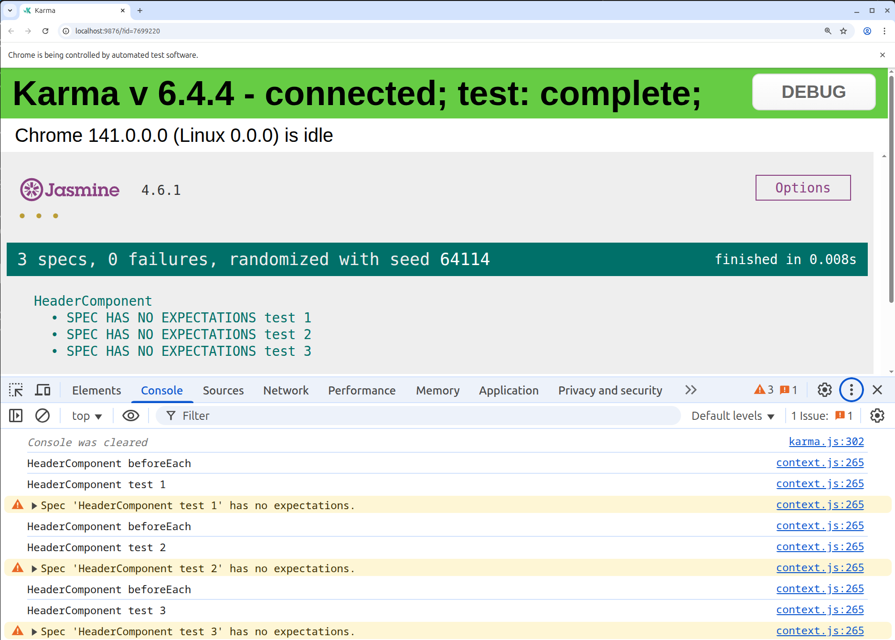

# Testing

See https://www.youtube.com/watch?v=TrW-mtmEa44&list=PL5Agzt13Z4g_D7RjXZN8h3nR_Gpf-rcjJ

# git

```bash

# Create a tag for this feature
git tag -a part2 -m "Angular test flow"

# Push the tag
git push origin part2
```

# part 1

- Jasmine - javascript test engine,
  - does not require DOM
  - is not dependent on other javascript frameworks
  - supports asynchronous testing
- Karma - Angular testing test automation tool
  - is opensource
  - runs javascript tests on nodejs
  - is not a test framework
  - executes test cases on any browser

# part 2

See https://www.youtube.com/watch?v=IbHOkXR8l2o&list=PL5Agzt13Z4g_D7RjXZN8h3nR_Gpf-rcjJ&index=2

For angular when creating a component <component.ts> there will also be a <component.spec.ts> file used to test the component.

For the generated application the following application test is created (Angular 19)

```ts
describe("AppComponent", () => {
  beforeEach(async () => {
    await TestBed.configureTestingModule({
      imports: [AppComponent],
    }).compileComponents();
  });

  it("should create the app", () => {
    const fixture = TestBed.createComponent(AppComponent);
    const app = fixture.componentInstance;
    expect(app).toBeTruthy();
  });

  it(`should have the 'junittests' title`, () => {
    const fixture = TestBed.createComponent(AppComponent);
    const app = fixture.componentInstance;
    expect(app.title).toEqual("junittests");
  });

  it("should render title", () => {
    const fixture = TestBed.createComponent(AppComponent);
    fixture.detectChanges();
    const compiled = fixture.nativeElement as HTMLElement;
    expect(compiled.querySelector("h1")?.textContent).toContain(
      "Hello, junittests"
    );
  });
});
```

- describe defines the component to test, in this case 'AppComponent'
- it with a title is an actual testcase for this component

Angular testing package includes two utilities called TestBed and async.

- TestBed is the main Angular utility package
- The describe container has different blocks:
  - it
  - beforeEach
  - xit
  - ...
- beforeEach runs before any other block. Other blocks do not depend on each other.


# part 3

See https://www.youtube.com/watch?v=DAqibpw2hUc&list=PL5Agzt13Z4g_D7RjXZN8h3nR_Gpf-rcjJ&index=3

Execute the test by the following command from the command line in the main project directory (./junittests)

```bash
ng test
```

This starts the test and shows the results in a browser window.

Add a new test

```ts
it("My first test", () => {
  expect(1 + 1).toEqual(2);
});
```

Execute test from command line using

```bash
ng test --include="src/app"
```

This scans the src/app (sub)directories for \*.spec.ts files to execute.

# part 4

see https://www.youtube.com/watch?v=EiQnQ6JHq9M&list=PL5Agzt13Z4g_D7RjXZN8h3nR_Gpf-rcjJ&index=4

Jasmin and Karma Configuration with Angular

The [package.json](./package.json) file contains in the devDependencies section:

```json
    "@types/jasmine": "~5.1.0",
    "jasmine-core": "~5.6.0",
    "karma": "~6.4.0",
    "karma-chrome-launcher": "~3.2.0",
    "karma-coverage": "~2.2.0",
    "karma-jasmine": "~5.1.0",
    "karma-jasmine-html-reporter": "~2.1.0",
```

These package are related to Karma and Jasmin needed for testing.

The angular.json file contains specification for testing

```json
        "test": {
          "builder": "@angular-devkit/build-angular:karma",
          "options": {
            "polyfills": [
              "zone.js",
              "zone.js/testing"
            ],
            "tsConfig": "tsconfig.spec.json",
            "assets": [
              {
                "glob": "**/*",
                "input": "public"
              }
            ],
            "styles": [
              "src/styles.css"
            ],
            "scripts": []
          }
```

In Angular V19 there is no karma.conf.js since the Angular development team began deprecating Karma in favor of runners like Jest and the Web Test Runner (WTR). This change has become more apparent in the latest versions (like v17, v18, and v19).

If needed a karma config file can be created by

```bash
ng generate config karma
```

Setting default browser

```bash
ng test --browsers=ChromeHeadless # chrome headless
ng test --browsers=Chrome         # chrome browser
ng test --browsers=Firefox        # firefox browser
```

# part 5

See https://www.youtube.com/watch?v=XC0AOzvXMsA&list=PL5Agzt13Z4g_D7RjXZN8h3nR_Gpf-rcjJ&index=5

First Angular unit test case

# part 6

https://www.youtube.com/watch?v=uSkeQ9WZRXg&list=PL5Agzt13Z4g_D7RjXZN8h3nR_Gpf-rcjJ&index=6

Exclude Angular unit test from execution

examples

## Exclude a specific test

To exclude an Angular unit test use xit instead of it

The [application.component.spec.ts](./src/app/app.component.spec.ts) contains a test to check multiply

to enable the test use:

```ts
it("Check multiply", () => {
  let a = 2;
  let b = 3;
  expect(multiply(a, b)).toEqual(6);
});
```

to disable the test use:

```ts
xit("Check multiply", () => {
  let a = 2;
  let b = 3;
  expect(multiply(a, b)).toEqual(6);
});
```

## Exclude the component test

To exclude the complete component test prefix `describe` with x giving `xdescribe`

to enable the component test use:

```ts
describe("AppComponent", () => {
  let component = new AppComponent();
}
```

to disable the component test use:

```ts
xdescribe("AppComponent", () => {
  let component = new AppComponent();
}
```

# part 7

See https://www.youtube.com/watch?v=oz36gLrnfZU&list=PL5Agzt13Z4g_D7RjXZN8h3nR_Gpf-rcjJ&index=7

Jasmin matchers in Angular test cases

Matchers:

- are compare functions to verify a test values matches the expected value
- use javascript functions to do the compare and return a boolean representing if the match is successfull
- there are two type of matchers
  - builtin
  - custom

# part 8

See https://www.youtube.com/watch?v=HnBjT8CM-Wk&list=PL5Agzt13Z4g_D7RjXZN8h3nR_Gpf-rcjJ&index=8

ToBe and ToEqual matchers

## ToBe

ToBe is a matcher for primitive types like strings, numbers, booleans.

## ToEqual

ToEqual is a matcher for anything, primitive types and non primitive types.

# part 9

See https://www.youtube.com/watch?v=rLTkvlm5e1o&list=PL5Agzt13Z4g_D7RjXZN8h3nR_Gpf-rcjJ&index=9

Builtin matchers

There are a lot of builtin matchers:

- toBe
- toBeTrue
- toBeTruthy
- toBeFalsy

## toBe

- performs test actual === expected
- syntax expect(flag).toBe(true|false), this only passes if the value of flag matches true|false
- can only be uses for primitive boolean type

## toBeTrue

- performs test (actual === true || is(actual, 'Boolean') && actual.valueOf())
- syntace expact(flag).toBeTrue()
- can be used for primitive boolean type and a Boolean object

## toBeTruthy

- check if result is equal true

examples:

```javascript
expect(true).toBeTruthy(); // true
expect("1").toBeTruthy(); // true
expect(0).toBeTruthy(); // false
expect(undefined).toBeTruthy(); // false
expect(NaN).toBeTruthy(); // false
expect(false).toBeTruthy(); // false
expect("").toBeTruthy(); // false
```

## toBeFalsy

- check if result equal to false

# part 10

See https://www.youtube.com/watch?v=LQStUjhJMGc&list=PL5Agzt13Z4g_D7RjXZN8h3nR_Gpf-rcjJ&index=10

ToBeGreaterThan,ToBeLessThan, ToBeGreaterThanOrEqual and ToBeLessThanOrEqual

- toBeGreaterThan is a comparison function that evaluates to true or false
- toBeLessThan is a comparison function that evaluates to true or false
- toBeGreaterThanOrEqual is a comparison function that evaluates to true or false
- toBeLessThanOrEqual is a comparison function that evaluates to true or false

# part 11

See https://www.youtube.com/watch?v=mhH-qQhrl-8&list=PL5Agzt13Z4g_D7RjXZN8h3nR_Gpf-rcjJ&index=11

toMatch and toBeCloseTo

- toMatch is used to match regular expressions
- toBeCloseTo checks if a given number is close (given number of precision) to another number

# part 12

See https://www.youtube.com/watch?v=mxzog_kNLjE&list=PL5Agzt13Z4g_D7RjXZN8h3nR_Gpf-rcjJ&index=12

toBeDefined and toBeUndefined

- toBeDefined compare against defined
- toBeUndefined compare against undefined

# part 13

See https://www.youtube.com/watch?v=GjaIrJSZiuI&list=PL5Agzt13Z4g_D7RjXZN8h3nR_Gpf-rcjJ&index=13

Several matchers

# part 14

See https://www.youtube.com/watch?v=RP2wLIxGzvk&list=PL5Agzt13Z4g_D7RjXZN8h3nR_Gpf-rcjJ&index=14

beforeEach and afterEach

- beforeEach is run before each test
- afterEach is run after each test

Created a new component to show effects of beforeEach/afterEach test

```bash
ng generate component header
```

To show the output of the src/app/header/header.component.spec.ts use from the project root folder

```bash
ng test --include src/app/header
```

The header.component.spec.ts contains

```ts
import { ComponentFixture, TestBed } from "@angular/core/testing";

import { HeaderComponent } from "./header.component";

describe("HeaderComponent", () => {
  it("test 1", () => {
    console.log("HeaderComponent test 1");
  });

  it("test 2", () => {
    console.log("HeaderComponent test 2");
  });

  it("test 3", () => {
    console.log("HeaderComponent test 3");
  });
});
```

After adding a beforeEach the header.component.spec.ts file contains

```ts
import { ComponentFixture, TestBed } from "@angular/core/testing";

import { HeaderComponent } from "./header.component";

describe("HeaderComponent", () => {
  beforeEach(function () {
    console.log("HeaderComponent beforeEach");
  });

  it("test 1", () => {
    console.log("HeaderComponent test 1");
  });

  it("test 2", () => {
    console.log("HeaderComponent test 2");
  });

  it("test 3", () => {
    console.log("HeaderComponent test 3");
  });
});
```

with as output 

# part 15

See https://www.youtube.com/watch?v=scOB_gqgt7g&list=PL5Agzt13Z4g_D7RjXZN8h3nR_Gpf-rcjJ&index=15

BeforeAll and AfterAll

- beforeAll executes only once before the describing block
- afterAll executes only once after the describing block

# part 16

See https://www.youtube.com/watch?v=hw0OWwv2orI&list=PL5Agzt13Z4g_D7RjXZN8h3nR_Gpf-rcjJ&index=16

Arrange Act Assert

- Arrange inputs and targets. Arrange should setup the test case.
- Act on target behaviour. Act steps should cover the main thing to be tested.
- Assert expected outcomes. Assert verifies the outcome of Act steps.

Created a new component to show effects of beforeEach/afterEach test

```bash
ng generate component arrange
```

To show the output of the src/app/arrange/arrange.component.spec.ts use from the project root folder

```bash
ng test --include src/app/arrange
```

# part 17

See https://www.youtube.com/watch?v=OIrKMeT84gg&list=PL5Agzt13Z4g_D7RjXZN8h3nR_Gpf-rcjJ&index=17

TestBed and Component Fixture

Created a new component to show effects of beforeEach/afterEach test

```bash
ng generate component student
```

To show the output of the src/app/arrange/student.component.spec.ts use from the project root folder

```bash
ng test --include src/app/student
```

ATB (Angular Test Bed) is a high level Angular Only testing framework which allows easy test behaviours that depend on the Angular framework.

When to use ATB

- test interaction of a directive or component with its template
- test change detection
- gives access to components and services for unit testing
- test the Angular dependency injection (DI) framework
- test using NgModule configuration in the application
- test userinteraction from clicks and input fields

# part 18

SpyOn to mock and Stub methods in angular unit test

SpyOn is a jasmin method

- that allows us to mock the execution of an Angular method
- check wheter a method was called on not, without leaving Subject Under Test (SUT)
- that supports chaining to get dummy return values using `.and.returnvalue()`
- that can call the original function using `.and.callThrough()`

Comparison

- _Stub_: Stub is a dummy piece of code that lets test run, but you don't care what happens.
- _Mock_: Mock is a dummy piece of code that you **VERIFY** is called correctly as part of the test.
- _Spy_: Spy is a dummy piece of code that intercepts some calls to a real piece of code, allowing you to verify calls without replacing the entire original object.

# part 19

See https://www.youtube.com/watch?v=KlYRjvT1DTE&list=PL5Agzt13Z4g_D7RjXZN8h3nR_Gpf-rcjJ&index=19

Change detection

- change detection is the backbone of the Angular framework, each component has its own change detector.
- Angular detects changes in the data of the component and can rerender the view of the component data. Angular make sure the model and view of the data in the component are in sync.
- change detection means updating the view when the model (data) change.

# part 20

See https://www.youtube.com/watch?v=4mfNm-oypGs&list=PL5Agzt13Z4g_D7RjXZN8h3nR_Gpf-rcjJ&index=20

Debugging element and DOM events

- DebugElement is an Angular class that contains all kinds of references and methods relevant to investigate an element as well as the component. Example: `fixture.debugElement.query(By.css('#h1'))`
- Instead of creating an HTML element tree Angular creates a DebugElement tree that wraps the native elements for the runtime platform.
- The nativeElement property unwraps the DebugElement and returns the platform specific element object.
- NativeElement returns a reference to the DOM element.
- triggerEventHandler is a function that exists on Angulars DebugElement.
- See https://angular.io/api/core/DebugElement

# part 21

See https://www.youtube.com/watch?v=Qx_biJBb5xc&list=PL5Agzt13Z4g_D7RjXZN8h3nR_Gpf-rcjJ&index=21

Call private Methods and inspect private variables

# part 22

See https://www.youtube.com/watch?v=oZjdvSs8_Jk&list=PL5Agzt13Z4g_D7RjXZN8h3nR_Gpf-rcjJ&index=22

Spyon private methods

# part 23

See https://www.youtube.com/watch?v=omHcoBB6TvU&list=PL5Agzt13Z4g_D7RjXZN8h3nR_Gpf-rcjJ&index=23

Unit test on Interpolation

Interpolation is a technique that allows the user to bind a value to a UIElement. The binding is a one-way binding. This means when the value of a field bound using interpolation changes, the representation of the field on a page also changes.
The return type of the interpolation is always a string.

# part 24

See https://www.youtube.com/watch?v=83vfCU6vZy8&list=PL5Agzt13Z4g_D7RjXZN8h3nR_Gpf-rcjJ&index=24

Unit test on property binding

Interpolation is a special syntax that Angular converts into Property binding (a pair of square brackets). It's a convenient alternative to property binding.
To set an element property to a non-string value we must use property binding.

# part 25

See https://www.youtube.com/watch?v=O8IbljrQMI4&list=PL5Agzt13Z4g_D7RjXZN8h3nR_Gpf-rcjJ&index=25

Unit test on ngClass and ngStyle binding

# part 26

See https://www.youtube.com/watch?v=85JmKxWnFwY&list=PL5Agzt13Z4g_D7RjXZN8h3nR_Gpf-rcjJ&index=26

Unit test on Attribute binding

# part 27

See https://www.youtube.com/watch?v=JXHA48fkiUU&list=PL5Agzt13Z4g_D7RjXZN8h3nR_Gpf-rcjJ&index=27

Unit test on event binding

# part 28

See https://www.youtube.com/watch?v=_OqHcOHp8LE&list=PL5Agzt13Z4g_D7RjXZN8h3nR_Gpf-rcjJ&index=28

WhenStable, Async Test and twoWay data binding

- *WhenStable*, the fixture.whenStable() returns a promise that resolves when the javascript engine's task queue becomes empty.
- *Async*, the async utility tells Angular to run the code in a dedicated test zone that intercepts promises. The use of async with whenStable allows us to wait until all promises have been resolved to run our expectations.
- the test resumes within the promise callback, which calls detectChanges() to update the quote element with the expected text.

# part 29

See https://www.youtube.com/watch?v=ZPAJanzPD70&list=PL5Agzt13Z4g_D7RjXZN8h3nR_Gpf-rcjJ&index=29

fakeAsync and async

*Async testing*
- for the jasmine done function and spy callbacks we attach specific callbacks to spies so we know when promises are resolved. We add our testing code to those callbacks and then call the done function.
- when using Angular async and whenStable functions we don't need to track the promises ourselves but still need to lay our code out via callback functions which can be hard to read.
- we can use Angular fakeAsync and tick functions, this additionally lets lay out our async test code as if it were synchronous.
- the problem with async is that we still have to introduce real waiting in our tests. This can make our tests very slow. fakeAsync comes to the rescue and helps to test asynchronous code in a synchronous way.

# part 30

See https://www.youtube.com/watch?v=Uj0kjr8TrtE&list=PL5Agzt13Z4g_D7RjXZN8h3nR_Gpf-rcjJ&index=30

Unit testing on conditional rendering

# part 31

See https://www.youtube.com/watch?v=umaXhliEaPs&list=PL5Agzt13Z4g_D7RjXZN8h3nR_Gpf-rcjJ&index=31

Unit testing on ngSwitch

# part 32

See https://www.youtube.com/watch?v=Ll_cgWMO8Hg&list=PL5Agzt13Z4g_D7RjXZN8h3nR_Gpf-rcjJ&index=32

Unit testing on ngFor

# part 33

See https://www.youtube.com/watch?v=01e4Sg_JWM0&list=PL5Agzt13Z4g_D7RjXZN8h3nR_Gpf-rcjJ&index=33

Unit testing on dependency injection

Dependency injection is a designpattern in which a class request depends from an external source, rather than creating it.
Angulars DI (Dependeny injection) framework provides dependencies to a class upon instantiation.
Use Angular DI to increase flexibility an modularity in applications.

DI and testing
- TestBed is a mock environment to run Angular component tests without the browser
- The TestBed is the first and largest of the Angular testing utilities. It creates an Angular testing module = a NgModule class - that you configure with the configureTestingModule method to produce the module environment for the class you want to test.
- Using TestBet get method
- Using inject method
- By overriding component provider

# part 34

See https://www.youtube.com/watch?v=2QvsyfaDGDI&list=PL5Agzt13Z4g_D7RjXZN8h3nR_Gpf-rcjJ&index=34

Unit test case on pipe

Pipe in Angular

- Pipes are referred to as filters
- It helps to transform data and manage data within interpolation, denoted by {{ | }}
- It accepts data, arrays, integers and strings as input which are seperated by the '|' symbol.

example: `ng generate pipe fileSize`

# part 35

See https://www.youtube.com/watch?v=UOG9XWhZepY&list=PL5Agzt13Z4g_D7RjXZN8h3nR_Gpf-rcjJ&index=35

Unit testing @Input @Output directive

# part 36

See https://www.youtube.com/watch?v=nm3214rYZno&list=PL5Agzt13Z4g_D7RjXZN8h3nR_Gpf-rcjJ&index=36

Unit testing on routing

Routing in Angular
- Routing is an important key feature for frontend frameworks
- it is the proces of dividing the UI of an application using URL's
- it allows developers to build modern single-page applications that can be loaded once by a browser and provide multiple views.

# part 37

See https://www.youtube.com/watch?v=PcwFcBsTAtM&list=PL5Agzt13Z4g_D7RjXZN8h3nR_Gpf-rcjJ&index=37

Unit testing on lazy loading

Lazy loading
- a technology of angular that allows you to load Javascript components when a specific route is activated. It improves application load time speed by splitting the application into many bundles. Bundles are loaded when needed.
- helps to keep bundle size small, which reduces load times.
- an Angular module might be a unit to load. The @NgModule and decorators uses a metadata object to define the module. Main properties are:
  - import: Components of the module are used with other modules
  - decorations: it receives an array of components
  - exports: defines components usable by other modules
  - providers: declares services that are available to the entire application.

# part 38

See https://www.youtube.com/watch?v=ZS1k-hxMnh0&list=PL5Agzt13Z4g_D7RjXZN8h3nR_Gpf-rcjJ&index=38

Unit test cases on Http Client or service methods

- To perform theses tests one uses the HttpClientTestingModule.
- The HttpClientTestingModule injects the HttpTestingController.
- The HttpClientTestingModule allows you to easily mock HTTP requests by providing you with the HttpTestingController service.
- Using the HttpClientTestingModule and HttpTestingController provided by Angular makes mocking of testing results and testing http request possible. By providing many useful methods for checking http requests and providing mock responses for each request.

Examples of methods based on class definition

```typescript
abstract class HttpTestingController {
  abstract match(match: string | RequestMatch | ((req: HtpRequest<any>) => boolean)): TestRequest[];
  abstract expectOne(url: string, description?: string): TestRequest;
  abstract expectNone(url: string, description?: string): void;
  abstract verify(opts?: {ignoreCanceled?: boolean}): void;
}
```

## TestRequest
TestRequest is the response, a mock request that was received and is ready to be answered.
It contains a property `cancelled`. That indicates wheter the request was cancelled after it is send.

Methods of test request
- flush(), resolve the request by returning a body with additional HTTP information (such as response headers) if provided. If the request specifies an expected body type, the body is converted into the requested type. The default reponsetype is JSON.
- error(), resolve the request by returning an ErrorEvent (e.g. simulating a network failure). 
- event(), Deliver an arbitrary HttpEvent (such as progress event) on the response stream for the event.

## JSONPlaceholder
The JSONPlaceholder is a free online REST API that you can use whenever you need some fake data.
see https://jsonplaceholder.typicode.com/.

An alternative could be nodered (https://nodered.org) which makes it possible to provide data and behaviour. This can be placed in a docker image.

# part 39

See https://www.youtube.com/watch?v=8ExnbPphkr4&list=PL5Agzt13Z4g_D7RjXZN8h3nR_Gpf-rcjJ&index=39

Unit test case on Subscribe method.

# part 40

See https://www.youtube.com/watch?v=tHnRCGR5rbI&list=PL5Agzt13Z4g_D7RjXZN8h3nR_Gpf-rcjJ&index=40

Unit test for createSpy CreateSpyObj spyOn

- use spyOn when there is a specific method.
- use createSpy when there is no function to spy on. It will track calls and arguments like a spyOn but there is no implementation.
- use CreateSpyObj to create a mock that will spy on one or more methods. It returns an object that has a propertyfor each string that is a spy.

# part 41

See https://www.youtube.com/watch?v=DcZog1vjA4Q&list=PL5Agzt13Z4g_D7RjXZN8h3nR_Gpf-rcjJ&index=41

unit test cases on reactive forms

Howto use reactive forms
- reactive forms are forms in which we define the structure of the form in the component class
- we can create the form with Form Groups, Form Controls and Form Arrays
- you also can define validation rules in the component class. Then we bind it to the HTML form in the template
- to use reactive form controls, import ReactiveFormsModule from @angular/forms and add it to the NgModule's import array
- to register a single form control import the FormControl class and create a new instance of the FormControl to save as a class property.

This module needs bootstrap.
Which is added from https://cdn.jsdelivr.net/npm/bootstrap@5.3.8/dist/css/bootstrap.min.css into index.html

# part 42

See https://www.youtube.com/watch?v=5Ueip44kjsQ&list=PL5Agzt13Z4g_D7RjXZN8h3nR_Gpf-rcjJ&index=42

Unit test case on template driven form

Template driven form
- template driven forms use two-way data binding to update the data model in the component as changes are made in the template and vice versa.
- template driven forms are forms whe we write logic, validations controls etc in the template part of the code (html code). The template is responsible for setting up the form, the validation, control, group etc.

Differences between template driven and reactive forms:
- template driven forms are based only on template directives while reactive forms are defined programmatically at the level of the component class. Reactive forms are a better default choice for new applications. They are more powerful and easier to use.

# part 43

See https://www.youtube.com/watch?v=AuWdhKs8FL0&list=PL5Agzt13Z4g_D7RjXZN8h3nR_Gpf-rcjJ&index=43

Code coverage of angular unit test case

*Code coverage*
- code coverage also called test coverage, tells you which parts of your code are executed by running the unit and integration tests. Code coverage is expressed as a percentage. For example 80% statements or branches or functions or lines
- to generate a coverage report run the following command `ng test --nowatch --code-coverage` or `ng test --code-coverage`
- to generate code coverage of a specific component use `ng test --code-coverage --no-watch --include src/app/<component>` 
- after running report generation with `ng test --no-watch --code-coverage` a report is available in `<project>/coverage/junittests/index.html`

example:
```bash
$ ng test --code-coverage --no-watch --include src/app/part43
=============================== Coverage summary ===============================
Statements   : 100% ( 5/5 )
Branches     : 100% ( 0/0 )
Functions    : 100% ( 2/2 )
Lines        : 100% ( 5/5 )
================================================================================
```

# part 44

See https://www.youtube.com/watch?v=9HYKU2zzj-0&list=PL5Agzt13Z4g_D7RjXZN8h3nR_Gpf-rcjJ&index=44

Integration Angular with youtube

Add a special angular module
```bash
ng add @angular/youtube-player
```