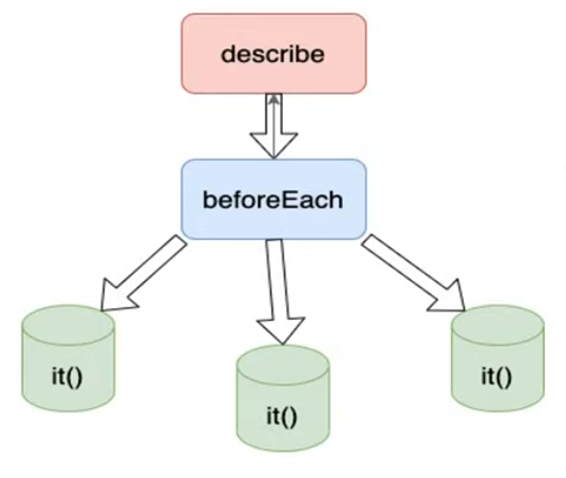

# Testing

See https://www.youtube.com/watch?v=TrW-mtmEa44&list=PL5Agzt13Z4g_D7RjXZN8h3nR_Gpf-rcjJ

# git

```bash

# Create a tag for this feature
git tag -a part2 -m "Angular test flow"

# Push the tag
git push origin part2
```

# part 1

- Jasmine - javascript test engine,
  - does not require DOM
  - is not dependent on other javascript frameworks
  - supports asynchronous testing
- Karma - Angular testing test automation tool
  - is opensource
  - runs javascript tests on nodejs
  - is not a test framework
  - executes test cases on any browser

# part 2

See https://www.youtube.com/watch?v=IbHOkXR8l2o&list=PL5Agzt13Z4g_D7RjXZN8h3nR_Gpf-rcjJ&index=2

For angular when creating a component <component.ts> there will also be a <component.spec.ts> file used to test the component.

For the generated application the following application test is created (Angular 19)

```ts
describe("AppComponent", () => {
  beforeEach(async () => {
    await TestBed.configureTestingModule({
      imports: [AppComponent],
    }).compileComponents();
  });

  it("should create the app", () => {
    const fixture = TestBed.createComponent(AppComponent);
    const app = fixture.componentInstance;
    expect(app).toBeTruthy();
  });

  it(`should have the 'junittests' title`, () => {
    const fixture = TestBed.createComponent(AppComponent);
    const app = fixture.componentInstance;
    expect(app.title).toEqual("junittests");
  });

  it("should render title", () => {
    const fixture = TestBed.createComponent(AppComponent);
    fixture.detectChanges();
    const compiled = fixture.nativeElement as HTMLElement;
    expect(compiled.querySelector("h1")?.textContent).toContain(
      "Hello, junittests"
    );
  });
});
```

- describe defines the component to test, in this case 'AppComponent'
- it with a title is an actual testcase for this component

Angular testing package includes two utilities called TestBed and async.

- TestBed is the main Angular utility package
- The describe container has different blocks:
  - it
  - beforeEach
  - xit
  - ...
- beforeEach runs before any other block. Other blocks do not depend on each other.



# part 3

See https://www.youtube.com/watch?v=DAqibpw2hUc&list=PL5Agzt13Z4g_D7RjXZN8h3nR_Gpf-rcjJ&index=3

Execute the test by the following command from the command line in the main project directory (./junittests)

```bash
ng test
```

This starts the test and shows the results in a browser window.

Add a new test

```ts
it("My first test", () => {
  expect(1 + 1).toEqual(2);
});
```

Execute test from command line using

```bash
ng test --include="src/app"
```

This scans the src/app (sub)directories for *.spec.ts files to execute.